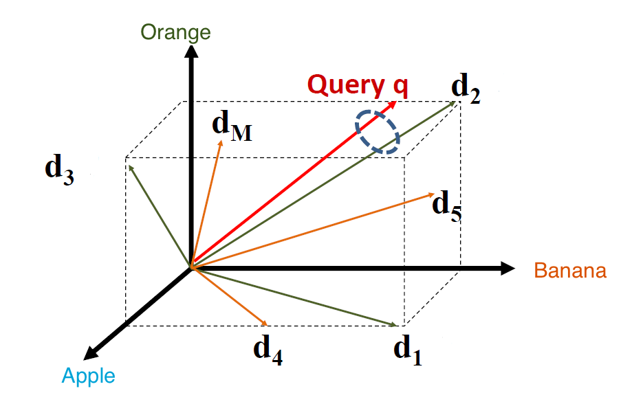

# Natural Language Processing in Python

This tutorial is an overview of available tools in python for text mining
and natural language processing. We will also go through some recent technologies
such as deep learning in NLP and word embedding. 

## Vector space representation of documents

A very simple approach is to use each word as an *atomic* type and as a a basis for a vector space:



For example imagine a world where there exist only 3 words: "Apple", "Orange", and "Banana" and every
sentence or document is made of them. They become the basis of a 3 dimenstional vector space:

```
Apple  ==>> [1,0,0]
Banana ==>> [0,1,0]
Orange ==>> [0,0,1]
```

Then a *"sentence"* or a *"document"* becomes the linear combination of these vectors where the number of
the counts of appearance of the words is the coefficient along that dimenstion.
For example in the image above:

```
d3 = "Apple Orange Orange Apple" ==>> [2,0,2]
d4 = "Apple Banana Apple Banana" ==>> [2,2,0]
d1 = "Banana Apple Banana Banana Banana Apple" ==>> [2,4,0]
d2 = "Banana Orange Banana Banana Orange Banana" ==>> [0,4,2]
d5 = "Banana Apple Banana Banana Orange Banana" ==>> [1,4,1]
```

Now the similarity of the documents, or a query to a document can be measured by the similarity of these
vectors (for example cosine similarity).

## Links

<http://www.nltk.org/book/>

<http://cs224d.stanford.edu/syllabus.html>

<http://papers.nips.cc/paper/5021-distributed-representations-of-words-and-phrases-and-their-compositionality.pdf>

<http://arxiv.org/pdf/1301.3781.pdf>

<http://research.microsoft.com/pubs/189726/rvecs.pdf>

<http://nlp.stanford.edu/pubs/glove.pdf>

<http://www.aclweb.org/anthology/P12-1092>


<http://rare-technologies.com/deep-learning-with-word2vec-and-gensim/>

<https://code.google.com/archive/p/word2vec/>

<http://radimrehurek.com/gensim/tutorial.html>

<http://benjaminbolte.com/blog/2016/keras-language-modeling.html#characterizing-the-attentional-lstm>

<https://github.com/piskvorky/gensim>

<http://rare-technologies.com/word2vec-tutorial>

<http://google-opensource.blogspot.ca/2013/08/learning-meaning-behind-words.html>

<https://github.com/piskvorky/gensim/blob/develop/gensim/models/word2vec.py>

<http://arxiv.org/pdf/1506.03340v3.pdf>

<https://github.com/codekansas/keras-language-modeling>

<https://github.com/deepmind/rc-data>

<http://multithreaded.stitchfix.com/blog/2015/03/11/word-is-worth-a-thousand-vectors/>

<http://blog.echen.me/2011/08/22/introduction-to-latent-dirichlet-allocation/>

<https://arxiv.org/abs/1605.02019>

<https://github.com/cemoody/lda2vec>

<http://lda2vec.readthedocs.io/en/latest/>

<https://ayearofai.com/lenny-2-autoencoders-and-word-embeddings-oh-my-576403b0113a>

<https://docs.google.com/file/d/0B7XkCwpI5KDYRWRnd1RzWXQ2TWc/edit>

<https://github.com/vinhkhuc/kaggle-sentiment-popcorn>

<http://arxiv.org/abs/1412.5335>

<http://stanfordnlp.github.io/CoreNLP/>

<https://github.com/jeffreybreen/twitter-sentiment-analysis-tutorial-201107>

<http://www.idiap.ch/~apbelis/hlt-course/negative-words.txt>

<http://www.idiap.ch/~apbelis/hlt-course/positive-words.txt>

<https://dumps.wikimedia.org/enwiki/>

<https://dumps.wikimedia.org/enwiki/latest/enwiki-latest-pages-articles.xml.bz2>

<http://nlp.stanford.edu/pubs/glove.pdf>

<http://nlp.stanford.edu/projects/glove/>

<https://github.com/stanfordnlp/GloVe>

<http://www.cs.princeton.edu/~blei/papers/HoffmanBleiBach2010b.pdf>

<http://nbviewer.jupyter.org/github/danielfrg/word2vec/blob/master/examples/word2vec.ipynb>

<http://mattmahoney.net/dc/textdata.html>

<http://cs224d.stanford.edu/syllabus.html>

<http://www-personal.umich.edu/~ronxin/pdf/w2vexp.pdf>

<https://class.coursera.org/nlp/lecture/preview>

<https://www.tensorflow.org/versions/r0.8/tutorials/word2vec/index.html>

